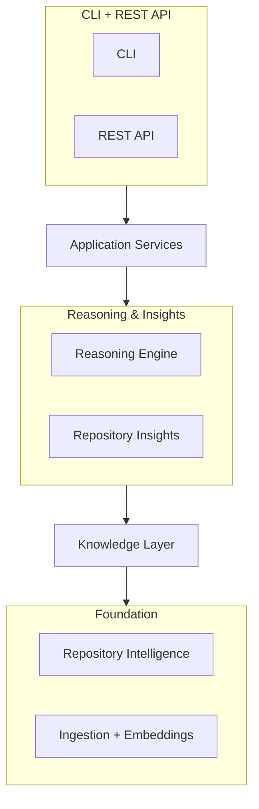
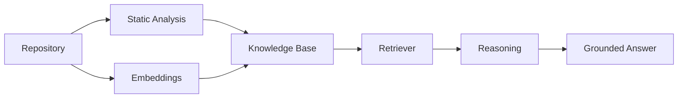

# Repository Intelligence Engine

*(working name — package is `codebase-agent`; the public repo name isn't finalized yet)*


**Ask questions about a codebase in plain English and get answers with exact file/line citations — not guesses.**

It combines deterministic static analysis (symbol tables, call/import/inheritance graphs) with semantic search and
an LLM reasoning step, then separately runs five LLM-free analyzers (dead code, circular dependencies, complexity,
TODOs, architecture) over the same repository. Everything is available through both a CLI and a REST API.

---

## Why this project exists

**Understanding a codebase you didn't write is slow.** You either read it file by file, or you `grep` for a name
and hope you land in the right place.

**`grep` finds text, not meaning.** It can't tell you what calls a function, what a function's callers actually
depend on, or which class a method really belongs to once inheritance is involved. It has no idea what "this" or
"the thing that validates requests" refers to.

**LLMs are fluent, but they haven't seen your repo.** Ask a general-purpose model about your codebase and it will
answer confidently — sometimes correctly, sometimes by pattern-matching to a *different* codebase it saw during
training. That's a hallucination that reads exactly like a real answer.

**The fix isn't "add an LLM" — it's grounding the LLM in facts the codebase itself provides.** This project builds
two independent, deterministic sources of truth first — an `ast`-based symbol/call/import graph, and semantic
search over embedded code chunks — and only then lets an LLM reason *over retrieved evidence*, citing exactly which
evidence it used. If the evidence doesn't support an answer, the system says so instead of guessing.

## Demo

Ingest a repository, then ask it a question. This is real, unedited output from the tiny example repo that ships
in [`examples/demo`](examples/demo) — run it yourself right after cloning, no external repo or API mocking needed:

```text
$ codebase-agent ingest examples/demo
demo
  files: 3
  symbols: 8
  schema_version: 1

$ codebase-agent ask demo "What does complete_task do?"
The complete_task function marks a task complete by updating its status to True
in the _tasks dictionary. It takes a slug as input and raises a KeyError if the
task does not exist. [1]

confidence=high evidence_sufficient=True
Citations:
  [1] tasks.TaskManager.complete_task (tasks.py:18-21)

$ codebase-agent analyze demo
Statistics
  files=3 symbols=8 (functions=3 methods=4 classes=1)
  call_edges=6 (resolved=2) import_edges=2 (resolved=2) inherits_edges=0

Findings by category
  architecture: 2
  dead_code: 5
```

`reporting.summarize_counts` — a function nothing else in the demo repo calls — is correctly flagged under
`dead_code`. Nothing above is edited or cherry-picked.

The same three operations are available over HTTP:

```text
$ curl -X POST http://127.0.0.1:8000/v1/repositories -d '{"source": "examples/demo"}'
$ curl -X POST http://127.0.0.1:8000/v1/repositories/demo/questions -d '{"question": "What does complete_task do?"}'
$ curl http://127.0.0.1:8000/v1/repositories/demo/insights
```

*(CLI and Swagger UI screenshots / a recorded GIF belong here — not yet captured.)*

## Features

**Repository Intelligence**
- `ast`-based symbol table for every function, method, and class in a repo
- Call, import, and class-hierarchy graphs (`networkx`), built independently of any LLM
- Best-effort symbol resolution that keeps unresolved edges instead of silently dropping them

**Question Answering**
- Natural-language questions, answered from retrieved evidence — not the model's training data
- Every claim is either cited back to an exact file/line range, or the answer says the evidence wasn't enough
- Confidence level, assumptions, and known limitations returned as structured fields, not buried in prose
- Optional grounding hints (`active_file`, `active_symbol`) for IDE-style "what does *this* do" questions

**Repository Insights** (deterministic, no LLM involved)
- Dead code
- Circular dependencies
- Complexity hotspots
- TODO / FIXME tracking
- Architecture findings (e.g. layering violations)

**Interfaces**
- CLI (`codebase-agent ingest / ask / analyze / list / info`)
- REST API (FastAPI) with interactive Swagger docs at `/docs`
- Both are thin wrappers over the same Application Service layer — zero logic duplicated between them

**Engineering Quality**
- 262 automated tests, run in CI on Python 3.10 and 3.12
- Strictly layered architecture, enforced by convention and reviewed in every PR (see [Contributing](CONTRIBUTING.md))
- 19 [Architecture Decision Records](docs/adr/README.md) documenting *why*, not just *what*
- Locked dependency set (`requirements.lock`) for reproducible installs
- Apache-2.0 licensed

## Architecture Overview



- **CLI / REST API** — the only user-facing surfaces; render the same data two different ways.
- **Application Services** — the single boundary the interfaces are allowed to call into.
- **Reasoning Engine / Repository Insights** — turn retrieved evidence into a cited answer, or run deterministic
  analyzers; neither one talks to the other.
- **Knowledge Layer** — the one access point everything above depends on for symbols, graphs, and search.
- **Repository Intelligence / Ingestion** — the two independent pipelines that build the Knowledge Layer's data:
  static analysis, and chunk-embed-store.

Each layer only depends on the layer directly below it. Full diagrams and the reasoning behind every boundary:
[`docs/architecture.md`](docs/architecture.md).

## Technology Stack

| Component | Technology | Purpose |
|---|---|---|
| Static analysis | Python `ast` + `networkx` | Symbol table and call/import/inheritance graphs |
| Orchestration | LangGraph | Deterministic single-pass pipeline (not an agentic loop — [ADR-0009](docs/adr/0009-deterministic-single-pass-orchestration.md)) |
| LLM | Groq API | Retrieval planning and grounded reasoning |
| Vector store | ChromaDB | Local, embedded semantic search index |
| Embeddings | `sentence-transformers` | Local, code-aware embedding model |
| REST API | FastAPI + Uvicorn | HTTP interface with auto-generated Swagger/OpenAPI docs |
| CLI | Typer + Rich | Terminal interface |
| Config | `pydantic-settings` + `python-dotenv` | `.env`-driven configuration |
| Testing | pytest | 262 tests, unit + integration markers |
| Lint / format | ruff | Enforced in CI |

## Quick Start

Requires Python 3.10+ and a [Groq API key](https://console.groq.com/keys).

```bash
git clone <this-repo>
cd <this-repo>

pip install -r requirements.lock   # exact, tested versions
pip install -e .                   # registers the `codebase-agent` command

cp .env.example .env               # then fill in GROQ_API_KEY
```

Install `torch` separately first with the CUDA build matching your GPU if you want GPU-accelerated embeddings
([instructions](https://pytorch.org/get-started/locally/)) — otherwise a CPU-only build installs automatically.

```bash
codebase-agent ingest examples/demo
codebase-agent ask demo "What does complete_task do?"
codebase-agent analyze demo
```

That's the whole loop — see [Demo](#demo) above for real output. Troubleshooting (CUDA OOM, batch size tuning)
lives in [`.env.example`](.env.example), not here.

## Usage

### CLI

```bash
codebase-agent ingest <path-or-git-url>          # ingest a local path or git URL
codebase-agent list                              # list ingested repositories
codebase-agent info <repo-name>                  # show metadata for one
codebase-agent ask <repo-name> "<question>"       # grounded, cited Q&A
codebase-agent ask <repo-name> "<question>" \
    --active-file src/app.py --active-symbol App  # optional IDE-style grounding
codebase-agent analyze <repo-name>                # run all 5 insight analyzers
codebase-agent analyze <repo-name> --category dead_code
```

### REST API

```bash
python scripts/serve_api.py
```

Open `http://127.0.0.1:8000/docs` for interactive Swagger docs, or `/openapi.json` for the raw schema.

```bash
# Ingest
curl -X POST http://127.0.0.1:8000/v1/repositories \
  -H "Content-Type: application/json" \
  -d '{"source": "https://github.com/psf/requests.git"}'

# Ask a grounded question
curl -X POST http://127.0.0.1:8000/v1/repositories/requests/questions \
  -H "Content-Type: application/json" \
  -d '{"question": "Where is authentication handled?"}'
```

```json
{
  "answer": "Authentication is handled by the auth module's AuthBase subclasses... [1]",
  "confidence": "high",
  "evidence_sufficient": true,
  "citations": [
    {"qualified_name": "requests.auth.HTTPBasicAuth", "file_path": "requests/auth.py", "start_line": 96, "end_line": 105}
  ]
}
```

(Response shown trimmed to the fields that matter here — the real response also includes `assumptions`,
`limitations`, `validation_issues`, `model`, and `prompt_version`.)

## Repository Analysis

Five analyzers run over a `KnowledgeBase`, independently of each other and without calling an LLM:

| Category | What it finds |
|---|---|
| Dead code | Symbols with no resolved callers anywhere in the repo |
| Circular dependencies | Import cycles between modules |
| Complexity | Functions/methods that are unusually large or branchy |
| TODO / FIXME | Outstanding markers left in comments |
| Architecture | Structural findings, e.g. layering violations |

They're deterministic on purpose: the same repository always produces the same findings, so results are
reproducible, diffable across commits, and safe to run in CI — none of which is true of an LLM's opinion.

## Question Answering



A question first goes to a planner, which decides *how* to answer it — symbol lookup, semantic search, call-graph
walk, import-graph walk, or class hierarchy, possibly several of these for compound questions like impact analysis.
Each step retrieves evidence from the Knowledge Base; nothing at this stage writes prose. Only once evidence is
gathered does the Reasoning Engine make a single forced tool call to the LLM over all of it — citations are
resolved back to exact file/line locations in Python, not transcribed by the model, so citation accuracy doesn't
depend on the model getting numbers right. A separate, deterministic (non-LLM) validation pass then flags things
like citation indices that don't exist or a "sufficient evidence" claim with none supplied.

## Project Highlights

- **262 automated tests**, run against every push/PR in CI (Python 3.10 and 3.12)
- **Strictly layered architecture** — six layers, each depending only on the one directly below it
- **19 Architecture Decision Records** — the reasoning behind every non-obvious design choice, not just the code
- **REST API and CLI**, both built on one Application Service layer with zero duplicated logic
- **AST-based static analysis** independent of any LLM — symbol table, call/import/inheritance graphs
- **ChromaDB** for local, embedded semantic search — no external vector database to run
- **LangGraph** used as a deterministic single-pass pipeline, not an unbounded agentic loop
- **CI pipeline** enforcing lint, format, and the full non-integration test suite
- **Apache-2.0** licensed

## Repository Structure

```
src/codebase_agent/
  intelligence/   AST-based static analysis: symbol table, call/import/inheritance graphs
  ingestion/      Discovers and loads source files from a repo checkout
  chunking/       Splits source files into embeddable chunks
  embeddings/     Embeds chunks with a local sentence-transformers model
  storage/        Persists chunk vectors in ChromaDB
  knowledge/      KnowledgeBase — the single access boundary everything above depends on
  retrieval/      Plans and executes evidence retrieval for a question
  reasoning/      Turns retrieved evidence into a citation-backed, confidence-scored answer
  insights/       Five deterministic, LLM-free repository analyzers
  application/    Application Services — the only thing the CLI/API call into
  api/            REST API (FastAPI)
  cli/            CLI (Typer)
  llm/ graph/ interface/   Legacy pipeline, superseded but kept in place untouched

docs/             Architecture overview and 19 ADRs
examples/demo/    A tiny real repo used by the Quick Start and demo above
scripts/          Entry points: cli.py, serve_api.py, ingest_repo.py, analyze_repo.py
tests/            262 tests, mirroring the src/codebase_agent layout
data/             Gitignored local artifacts: ingested repos, graph/knowledge JSON, Chroma store
```

## Documentation

- [Architecture](docs/architecture.md) — how the layers fit together
- [Architecture Decision Records](docs/adr/README.md) — why each decision was made
- API reference — interactive Swagger UI at `/docs` once `scripts/serve_api.py` is running
- [Contributing](CONTRIBUTING.md)
- [Security Policy](SECURITY.md)
- [Changelog](CHANGELOG.md)

## Development

```bash
pip install -r requirements.lock
pip install -e .

ruff check .                    # lint
ruff format --check .           # format check
pytest -m "not integration"     # full suite, no real API/model calls
pytest -m integration           # slower tests hitting the real Groq API and embedding model
```

CI (`.github/workflows/ci.yml`) runs lint, format check, and the non-integration suite on every push/PR, on
Python 3.10 and 3.12. All three must pass before a PR is merged.

## Roadmap

**Completed**
- Layered architecture: Repository Intelligence → Knowledge Layer → Retrieval → Reasoning / Insights → Application → CLI/API
- Grounded, citation-backed Q&A with confidence scoring and deterministic answer validation
- Five deterministic repository analyzers with a unified `RepositoryReport`
- REST API and CLI on a shared Application Service layer
- 19 ADRs, architecture doc, CI, locked dependency set, Apache-2.0 license

**Planned**
- LLM-generated repository summary (the `RepositoryReport.summary` field already exists, reserved for this)
- Splitting oversized `class_skeleton` chunks (very large classes) into multiple logical chunks for better retrieval
- Finalizing the public repository/package name

**Future ideas**
- Multi-language support beyond Python — the static-analysis output shape was deliberately kept language-agnostic
  for this ([ADR-0002](docs/adr/0002-python-first-before-multi-language-expansion.md))
- Runtime heuristics deliberately deferred so far, such as adaptive embedding batch sizing and automatic OOM recovery

## License

Apache License 2.0 — see [LICENSE](LICENSE) and [NOTICE](NOTICE).
