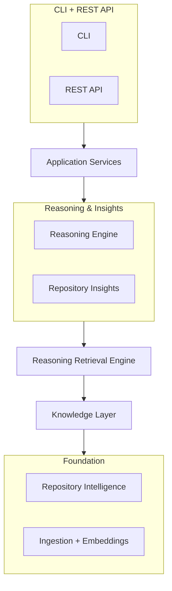
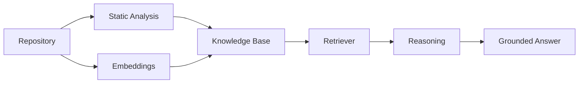

# Repository Intelligence Engine


**Ask questions about a codebase in plain English and get answers with exact file/line citations — not guesses.**

It combines deterministic static analysis (symbol tables, call/import/inheritance graphs) with semantic search and
an LLM reasoning step, then separately runs five LLM-free analyzers (dead code, circular dependencies, complexity,
TODOs, architecture) over the same repository. Everything is available through both a CLI and a REST API.

> [!NOTE]
> Pre-1.0 and Python-only today — multi-language support is deferred by design, not forgotten (see
> [Roadmap](#roadmap)). Package name is `codebase-agent`.

## Demo

Ingest a repository, then ask it a question. This is real, unedited output from the tiny example repo that ships
in [`examples/demo`](examples/demo) — run it yourself right after cloning, no external repo or API mocking needed:

```text
$ codebase-agent ingest examples/demo
demo
  files: 3
  symbols: 8
  schema_version: 1

$ codebase-agent ask demo "What does complete_task do?"
The complete_task function marks a task complete by updating its status to True
in the _tasks dictionary. It takes a slug as input and raises a KeyError if the
task does not exist. [1]

confidence=high evidence_sufficient=True
Citations:
  [1] tasks.TaskManager.complete_task (tasks.py:18-21)

$ codebase-agent analyze demo
Statistics
  files=3 symbols=8 (functions=3 methods=4 classes=1)
  call_edges=6 (resolved=2) import_edges=2 (resolved=2) inherits_edges=0

Findings by category
  architecture: 2
  dead_code: 5
```

`reporting.summarize_counts` — a function nothing else in the demo repo calls — is correctly flagged under
`dead_code`. Nothing above is edited or cherry-picked.

The same three operations are available over HTTP — see [Usage](#usage) below for the full, real request/response
pair. Interactive Swagger docs are at `/docs` once `python scripts/serve_api.py` is running.

*(CLI and Swagger UI screenshots / a recorded GIF belong here — not yet captured.)*

<details>
<summary><strong>Table of contents</strong></summary>

- [Demo](#demo)
- [Why this project exists](#why-this-project-exists)
- [How it's different](#how-its-different)
- [Features](#features)
- [Architecture Overview](#architecture-overview)
- [Technology Stack](#technology-stack)
- [Quick Start](#quick-start)
- [Usage](#usage)
- [Repository Analysis](#repository-analysis)
- [Question Answering](#question-answering)
- [Repository Structure](#repository-structure)
- [Documentation](#documentation)
- [Development](#development)
- [Roadmap](#roadmap)
- [FAQ](#faq)
- [License](#license)

</details>

---

## Why this project exists

**Understanding a codebase you didn't write is slow.** You either read it file by file, or you `grep` for a name
and hope you land in the right place.

**`grep` finds text, not meaning.** It can't tell you what calls a function, what a function's callers actually
depend on, or which class a method really belongs to once inheritance is involved. It has no idea what "this" or
"the thing that validates requests" refers to.

**LLMs are fluent, but they haven't seen your repo.** Ask a general-purpose model about your codebase and it will
answer confidently — sometimes correctly, sometimes by pattern-matching to a *different* codebase it saw during
training. That's a hallucination that reads exactly like a real answer.

**The fix isn't "add an LLM" — it's grounding the LLM in facts the codebase itself provides.** This project builds
two independent, deterministic sources of truth first — an `ast`-based symbol/call/import graph, and semantic
search over embedded code chunks — and only then lets an LLM reason *over retrieved evidence*, citing exactly which
evidence it used. If the evidence doesn't support an answer, the system says so instead of guessing.

## How it's different

Most "chat with your codebase" tools fall into two camps: IDE assistants (e.g. Copilot Chat, Cursor) that reason
over open-file context plus repo-wide semantic search, and generic RAG-over-code chatbots that embed a repo and
retrieve chunks by similarity alone. Both are genuinely useful. Neither typically has a real call/import/inheritance
graph to fall back on — so structural questions ("what calls this," "what does this inherit from") get answered by
the model *inferring* from retrieved text snippets, the same mechanism used for everything else.

| | IDE assistants (Copilot Chat, Cursor) | Generic RAG-over-code | This project |
|---|---|---|---|
| Grounding | Open files + semantic search | Semantic search only | Static analysis (exact) **and** semantic search (fuzzy), combined |
| "What calls this?" | Typically inferred by the model from retrieved text | Typically inferred by the model from retrieved text | Answered from an actual call graph, not inferred |
| Citation locations | Typically transcribed by the model | Typically transcribed by the model | Resolved to file/line in Python code, not by the model ([ADR-0010](docs/adr/0010-index-based-citation-resolution.md)) |
| Dead code / cycles / complexity | Not typically included | Not typically included | Five deterministic analyzers, no LLM involved |
| Explicit confidence + "evidence insufficient" | Varies by tool | Rarely surfaced | Always returned as structured fields, not buried in prose |
| Interface | IDE-embedded | Usually IDE-embedded or hosted SaaS | CLI + self-hostable REST API |
| Where your code goes | Cloud-hosted, provider-dependent | Usually cloud-hosted | Ingestion, embeddings, and the vector store are all local; only the final reasoning call (your question + retrieved evidence) leaves the machine |

This isn't a claim that those tools are worse — they solve a broader problem (general coding assistance) that this
project doesn't attempt. This project is narrower and more structural: it exists specifically for the "I need to
trust the answer enough to act on it" case.

## Features

**Repository Intelligence**
- `ast`-based symbol table for every function, method, and class in a repo
- Call, import, and class-hierarchy graphs (`networkx`), built independently of any LLM
- Best-effort symbol resolution that keeps unresolved edges instead of silently dropping them

**Question Answering**
- Natural-language questions, answered from retrieved evidence — not the model's training data
- Every claim is either cited back to an exact file/line range, or the answer says the evidence wasn't enough
- Confidence level, assumptions, and known limitations returned as structured fields, not buried in prose
- Optional grounding hints (`active_file`, `active_symbol`) for IDE-style "what does *this* do" questions

**Repository Insights** (deterministic, no LLM involved)
- Dead code
- Circular dependencies
- Complexity hotspots
- TODO / FIXME tracking
- Architecture findings (e.g. layering violations)

**Interfaces**
- CLI (`codebase-agent ingest / ask / analyze / list / info`)
- REST API (FastAPI) with interactive Swagger docs at `/docs`
- Both are thin wrappers over the same Application Service layer — zero logic duplicated between them

**Engineering Quality**
- 262 automated tests, run in CI on Python 3.10 and 3.12
- Layered architecture, six layers deep, reviewed by convention in every PR (see [Contributing](CONTRIBUTING.md)) —
  not yet machine-enforced, see [Roadmap](#roadmap)
- 19 [Architecture Decision Records](docs/adr/README.md) documenting *why*, not just *what*
- Locked dependency set (`requirements.lock`) for reproducible installs
- Apache-2.0 licensed

## Architecture Overview

Six layers, each depending only on the one directly below it:



- **CLI / REST API** — the only user-facing surfaces; render the same data two different ways.
- **Application Services** — the single boundary the interfaces are allowed to call into.
- **Reasoning Engine / Repository Insights** — turn retrieved evidence into a cited answer, or run deterministic
  analyzers; neither one talks to the other.
- **Reasoning Retrieval Engine** — gathers evidence for a question; never generates prose itself.
- **Knowledge Layer** — the one access point everything above depends on for symbols, graphs, and search.
- **Repository Intelligence / Ingestion** — the two independent pipelines that build the Knowledge Layer's data:
  static analysis, and chunk-embed-store.

Each layer only depends on the layer directly below it — reviewed by convention today, not yet enforced by tooling
(an automated import-boundary check is on the [Roadmap](#roadmap)). Full diagrams and the reasoning behind every
boundary: [`docs/architecture.md`](docs/architecture.md).

## Technology Stack

| Component | Technology | Purpose |
|---|---|---|
| Static analysis | Python `ast` + `networkx` | Symbol table and call/import/inheritance graphs |
| Orchestration | LangGraph | Deterministic single-pass pipeline (not an agentic loop — [ADR-0009](docs/adr/0009-deterministic-single-pass-orchestration.md)) |
| LLM | Groq API | Retrieval planning and grounded reasoning |
| Vector store | ChromaDB | Local, embedded semantic search index |
| Embeddings | `sentence-transformers` | Local, code-aware embedding model |
| REST API | FastAPI + Uvicorn | HTTP interface with auto-generated Swagger/OpenAPI docs |
| CLI | Typer + Rich | Terminal interface |
| Config | `pydantic-settings` + `python-dotenv` | `.env`-driven configuration |
| Testing | pytest | 262 tests, unit + integration markers |
| Lint / format | ruff | Enforced in CI |

## Quick Start

Requires Python 3.10+ and a [Groq API key](https://console.groq.com/keys).

```bash
git clone https://github.com/twisha-khurana/Repository-Intelligence-Engine.git
cd Repository-Intelligence-Engine

pip install -r requirements.lock   # exact, tested versions
pip install -e .                   # registers the `codebase-agent` command

cp .env.example .env               # then fill in GROQ_API_KEY
```

Install `torch` separately first with the CUDA build matching your GPU if you want GPU-accelerated embeddings
([instructions](https://pytorch.org/get-started/locally/)) — otherwise a CPU-only build installs automatically.

```bash
codebase-agent ingest examples/demo
codebase-agent ask demo "What does complete_task do?"
codebase-agent analyze demo
```

That's the whole loop — see [Demo](#demo) above for real output. Troubleshooting (CUDA OOM, batch size tuning)
lives in [`.env.example`](.env.example), not here.

## Usage

```bash
codebase-agent ask <repo-name> "<question>"      # CLI
python scripts/serve_api.py                      # REST API — Swagger docs at /docs
```

Every CLI command (`ingest`, `list`, `info`, `ask`, `analyze`) and every REST route, with full real
request/response examples, is documented in **[`docs/cli-and-api.md`](docs/cli-and-api.md)**.

## Repository Analysis

Five analyzers — dead code, circular dependencies, complexity, TODO/FIXME, architecture — run independently of
each other and without calling an LLM. Deterministic on purpose: the same repository always produces the same
findings, so results are reproducible, diffable across commits, and safe to run in CI.

Full details — what each analyzer finds, the `RepositoryReport`/`Finding` shape, a real captured example:
**[`docs/repository-insights.md`](docs/repository-insights.md)**.

## Question Answering



A question is planned (which retrieval strategy fits — symbol lookup, semantic search, a graph walk, or several for
compound questions), evidence is gathered but never turned into prose at that stage, and only then does the
Reasoning Engine make one forced tool call over all of it — citations are resolved back to exact file/line
locations in Python, never transcribed by the model.

Full pipeline — planning, execution, the reasoning tool schema, retry/degradation behavior, a real captured
example: **[`docs/question-answering.md`](docs/question-answering.md)**.

## Repository Structure

```text
src/codebase_agent/   intelligence, ingestion/chunking/embeddings/storage, knowledge, retrieval,
                      reasoning, insights, application, api, cli — plus a kept-in-place legacy pipeline
docs/                 Architecture, 19 ADRs, and per-layer deep dives
examples/demo/        A tiny real repo used throughout the README and docs — zero setup to try it
scripts/              Entry points: cli.py, serve_api.py, ingest_repo.py, analyze_repo.py
tests/                262 tests, mirroring the src/codebase_agent layout
data/                 Gitignored local artifacts: ingested repos, graph/knowledge JSON, Chroma store
```

Full folder-by-folder breakdown, including every subpackage under `src/codebase_agent/`:
**[`docs/project-structure.md`](docs/project-structure.md)**.

## Documentation

- [Architecture](docs/architecture.md) — how the layers fit together
- [Question Answering](docs/question-answering.md) — the ask/retrieval/reasoning pipeline in depth
- [Repository Insights](docs/repository-insights.md) — the five analyzers in depth
- [CLI and REST API Reference](docs/cli-and-api.md) — every command and route
- [Project Structure](docs/project-structure.md) — full folder-by-folder breakdown
- [Architecture Decision Records](docs/adr/README.md) — why each decision was made
- [Contributing](CONTRIBUTING.md)
- [Security Policy](SECURITY.md)
- [Changelog](CHANGELOG.md)

## Development

```bash
pip install -r requirements.lock
pip install -e .

ruff check .                    # lint
ruff format --check .           # format check
pytest -m "not integration"     # full suite, no real API/model calls
pytest -m integration           # slower tests hitting the real Groq API and embedding model
```

CI (`.github/workflows/ci.yml`) runs lint, format check, and the non-integration suite on every push/PR, on
Python 3.10 and 3.12. All three must pass before a PR is merged.

## Roadmap

**Completed**
- Layered architecture: Repository Intelligence → Knowledge Layer → Retrieval → Reasoning / Insights → Application → CLI/API
- Grounded, citation-backed Q&A with confidence scoring and deterministic answer validation
- Five deterministic repository analyzers with a unified `RepositoryReport`
- REST API and CLI on a shared Application Service layer
- 19 ADRs, architecture doc, CI, locked dependency set, Apache-2.0 license

**Planned**
- LLM-generated repository summary (the `RepositoryReport.summary` field already exists, reserved for this)
- Splitting oversized `class_skeleton` chunks (very large classes) into multiple logical chunks for better retrieval
- Automated import-boundary check in CI, so layering is enforced by tooling rather than PR review alone

**Future ideas**
- Multi-language support beyond Python — the static-analysis output shape was deliberately kept language-agnostic
  for this ([ADR-0002](docs/adr/0002-python-first-before-multi-language-expansion.md))
- Runtime heuristics deliberately deferred so far, such as adaptive embedding batch sizing and automatic OOM recovery

## FAQ

**Does my code get sent anywhere?**
Ingestion, chunking, embeddings, static analysis, and the vector store all run locally — nothing leaves the machine
while a repo is being ingested. Answering a question makes two calls to the Groq API: one to plan *how* to retrieve
evidence (your question only, no code), and one to reason over the evidence that retrieval gathers (your question
plus the retrieved snippets/citations).

**Can I use a different LLM or embedding model?**
The embedding model (`EMBEDDING_MODEL_NAME`, default `jinaai/jina-embeddings-v2-base-code`) and the Groq model
(`GROQ_MODEL`, default `llama-3.3-70b-versatile`) are both configurable via `.env`. The LLM *provider* is Groq-only
today — swapping to a different provider means changing `GroqClient` (`src/codebase_agent/llm/client.py`), not just
a config value.

**Why not just use Copilot Chat or Cursor?**
Different problem. Those are general-purpose coding assistants; this is narrower and structural — see
[How it's different](#how-its-different).

**Does it support languages other than Python?**
Not yet. Python-only today, deliberately — see [Roadmap](#roadmap) and
[ADR-0002](docs/adr/0002-python-first-before-multi-language-expansion.md).

**What happens if there isn't enough evidence to answer confidently?**
The answer says so: `evidence_sufficient: false` and low confidence, rather than a fabricated answer. See the
Question Answering section above.

**Is this production-ready?**
No — it's pre-1.0 and solo-maintained. See [Roadmap](#roadmap) and [Changelog](CHANGELOG.md) for what's done versus
planned.

## License

Apache License 2.0 — see [LICENSE](LICENSE) and [NOTICE](NOTICE).

---

Issues, questions, and pull requests are welcome — see [Contributing](CONTRIBUTING.md). If this is useful to you,
a star helps others find it.
