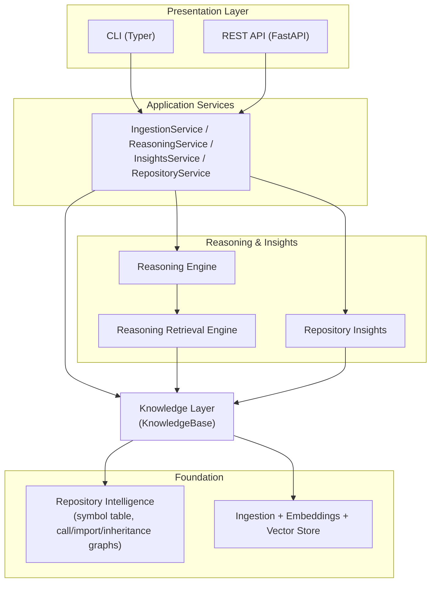
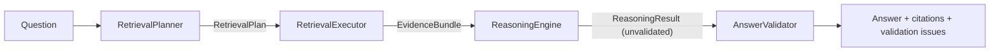

# Architecture

This document explains how the system is layered and why. For the reasoning behind individual decisions, see the
[Architecture Decision Records](adr/README.md) - this page focuses on how the pieces fit together; the ADRs focus on
why each piece is shaped the way it is.

## Overview

Each layer depends only on the layer(s) below it, through a narrow interface - never by reaching past it into
internals two layers down. The Presentation Layer, for example, never imports `codebase_agent.knowledge` or
`codebase_agent.retrieval` directly; it only calls Application Services.

Two pipelines feed the Knowledge Layer independently: **Repository Intelligence** (AST-based static analysis -
symbol table, call/import/inheritance graphs) and **Ingestion** (chunking, embedding, and storing source text for
semantic search). The Knowledge Layer is where they meet - it's the only thing anything above it is allowed to
depend on.

## Layers, bottom-up

### Ingestion Pipeline (`codebase_agent.ingestion`, `chunking`, `embeddings`, `storage`)

Discovers and loads Python source files from a repo checkout, splits them into embeddable chunks, embeds them with
`sentence-transformers` (a code-aware model), and persists chunk vectors in ChromaDB. `scripts/ingest_repo.py`
wires this together as the original end-to-end ingest entry point, and is still what every ingestion path
ultimately calls.

### Repository Intelligence (`codebase_agent.intelligence`)

A second, independent pipeline built alongside the chunker. `ast`-based extraction produces a repo-wide symbol
table plus import/call/class-hierarchy graphs (`networkx`), persisted per-repo as JSON. Call and inheritance
resolution is best-effort static matching (`self.`/`cls.` attributes, exact qualified names, then unambiguous
short-name fallback preferring the same file) - unresolved edges are kept, not dropped, marked with a `None`
qualified name rather than silently disappearing ([ADR-0004](adr/0004-best-effort-symbol-resolution-keep-unresolved-edges.md)).
Symbol names are module-qualified to avoid collisions across files (every script's `main`, for example), and
module-path resolution correctly strips a leading `src/` so PyPA src-layout repos resolve imports instead of
reporting them all as unresolved. Runs automatically as part of `scripts/ingest_repo.py`.

### Knowledge Layer (`codebase_agent.knowledge`)

The single access boundary every higher-level subsystem depends on - retrieval, reasoning, insights, the CLI, and
the REST API never talk to Chroma, NetworkX, or JSON files directly
([ADR-0005](adr/0005-knowledgebase-as-the-sole-access-boundary.md)). `KnowledgeBase` (a `Protocol`) is the contract;
`DefaultKnowledgeBase` is the implementation, composing the Repository Intelligence symbol table/edges, persisted
per-symbol and per-file source snippets (sliced at ingestion time so lookups don't depend on the checkout still
being on disk - [ADR-0006](adr/0006-self-contained-persisted-artifacts.md)), the vector store, and per-repo
metadata (`RepoMetadata`, including a `schema_version` checked at load time so stale or format-incompatible
artifacts fail clearly with a "re-ingest" error instead of silently misbehaving). `KnowledgeBaseFactory` builds
instances; `KnowledgeBaseRegistry` caches them per repo so repeated lookups don't reload from disk - construction
and lifecycle are deliberately separate classes. The interface is intentionally atomic (symbol/caller/callee/
import/inheritance lookups, semantic search, metadata) and deliberately generic (no analyzer-specific helpers like
`find_dead_code()`) - composition into higher-level operations is every consuming layer's own job.

### Reasoning Retrieval Engine (`codebase_agent.retrieval`)

Gathers evidence, never generates prose ([ADR-0008](adr/0008-retrieval-as-planning-and-execution.md)).
`RetrievalPlanner` (one Groq tool-calling call, no `KnowledgeBase` access) turns a question into a `RetrievalPlan` -
one or more `RetrievalStep`s naming a strategy (`symbol_lookup`, `semantic_search`, `call_graph`, `import_graph`,
`hierarchy`) plus target/query/direction; compound intents like impact analysis become multiple steps (resolve the
symbol, then walk its callers) rather than a new strategy. `RetrievalExecutor` dispatches each step to a
specialized retriever, all reading through `KnowledgeBase` only, and aggregates the results into an
`EvidenceBundle` - `EvidenceItem`s carry a normalized shape (`qualified_name`/`file_path`/`start_line`/`end_line`/
`content`/`explanation`/`confidence`), not the underlying `Symbol`/`CallEdge`/etc. objects
([ADR-0007](adr/0007-normalized-structured-outputs-at-layer-boundaries.md)). A failing or unregistered step is
recorded as a warning and skipped, not fatal - the bundle also carries `retrievers_used`, `warnings`, and
`execution_time_seconds` for debugging.

### Reasoning Engine (`codebase_agent.reasoning`)

Turns an `EvidenceBundle` into a grounded, citation-aware `ReasoningResult` - never the other way around. LangGraph
here is purely sequencing (`plan_retrieval -> execute_retrieval -> reason`, one pass, no cycles, no conditional
edges, no tool-calling loop - [ADR-0009](adr/0009-deterministic-single-pass-orchestration.md)), composing the
existing `RetrievalPlanner`/`RetrievalExecutor` without changing them.

`ReasoningEngine` makes one forced Groq tool call over all the evidence at once; citations are index-based - the
model names which numbered evidence item(s) it used, and the exact `file_path`/`start_line`/`end_line` are resolved
from the `EvidenceBundle` in Python, not transcribed by the LLM, so citation accuracy doesn't depend on the model
getting numbers right ([ADR-0010](adr/0010-index-based-citation-resolution.md)). `AnswerValidator` then runs a
handful of deterministic, non-LLM checks (hallucinated citation indices, empty answers, "sufficient" claimed
against zero evidence) and attaches any issues to the result - informational only, nothing here retries or
re-prompts ([ADR-0012](adr/0012-deterministic-non-llm-answer-validation.md)). Prompts live as external text files
under `reasoning/prompts/` (loaded via `string.Template`, not `str.format`, so literal `{}` in evidence/code
snippets can't break substitution - [ADR-0013](adr/0013-external-versioned-prompt-templates.md)), tagged with a
`prompt_version` on every result for future evaluation. `ReasoningResult` also carries `confidence`,
`evidence_sufficient`, `assumptions` (inferences not directly confirmed), and `limitations` (known gaps in the
evidence itself) as separate fields, rather than folding everything into prose.

### Repository Insights (`codebase_agent.insights`)

Deterministic, LLM-free repository analysis
([ADR-0014](adr/0014-independent-composable-analyzers.md)) - five independent `Analyzer`s (dead code, circular
dependencies, complexity, TODO/FIXME, architecture), each depending only on `KnowledgeBase` and never calling each
other. `AnalysisRunner` dispatches each and aggregates results into a `RepositoryReport` - the canonical output
consumed by the CLI and REST API - containing repo metadata, generic repo-wide statistics (file/symbol/edge
counts, independent of any analyzer), normalized `Finding`s (one shape for all five analyzers, same
"normalize at the boundary" approach as `EvidenceItem`), and a `summary: str | None` placeholder reserved for a
future LLM-generated repository summary built on top of this report. Findings get a stable, deterministic `id` so
the same issue matches across re-analysis runs.

### Presentation Layer (`codebase_agent.application`, `codebase_agent.api`, `codebase_agent.cli`)

Exposes everything above without adding new business logic
([ADR-0015](adr/0015-application-service-layer-as-the-sole-boundary.md)). Four Application Services
(`IngestionService`, `ReasoningService`, `InsightsService`, `RepositoryService`) are the *only* thing the CLI and
FastAPI depend on - neither ever imports `intelligence`, `knowledge`, `retrieval`, `reasoning`, or `insights`
directly. Services return the same dataclasses those subsystems already produce (`RepoMetadata`, `ReasoningResult`,
`RepositoryReport`); a small `ApplicationError` hierarchy is what CLI/API actually catch, translated once at the
service boundary from lower-layer exceptions
([ADR-0017](adr/0017-application-level-exception-translation.md)). Pydantic request/response schemas exist only at
the FastAPI boundary - the CLI renders the same dataclasses directly with Rich, no Pydantic involved
([ADR-0016](adr/0016-pydantic-at-the-api-boundary-only.md)). `KnowledgeBaseRegistry`/embedder/Groq-client
singletons live once on `app.state` (attached at startup), not reconstructed per request - services are cheap and
built fresh per request from those shared singletons via `Depends()`
([ADR-0018](adr/0018-shared-singletons-via-app-state.md)). Every API request gets a `uuid4` id (via a contextvar,
so any log line anywhere during that request's handling picks it up automatically) surfaced as `X-Request-ID`, in
structured log lines, and in error response bodies
([ADR-0019](adr/0019-lightweight-request-correlation.md)).

## Legacy pipeline

`codebase_agent.llm`, `codebase_agent.graph`, the legacy `CodeRetriever` (`codebase_agent.retrieval.retriever`),
and `codebase_agent.interface` are the original agentic entry point: a Groq client, composable retrieval
primitives over the vector store, a LangGraph router/retrieve/answer pipeline, and a Rich-rendered CLI
(`scripts/ask.py`). They're superseded in normal usage by the Reasoning Retrieval Engine and Reasoning Engine
described above, but kept in place and untouched rather than deleted - a deliberate project rule against modifying
working legacy code without explicit reason to. Prefer `scripts/cli.py` / the `codebase-agent` command for
day-to-day use; `scripts/ask.py` remains mainly as a reference point for what changed.

## See also

- [Architecture Decision Records](adr/README.md) - the full, cross-referenced rationale behind every decision
  above, in Nygard format.
- [README](../README.md) - installation and usage.
