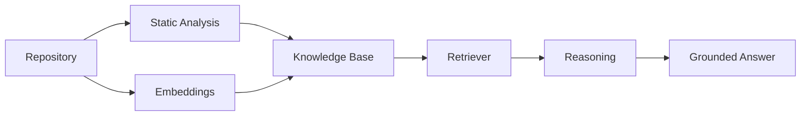

# Question Answering

How a natural-language question becomes a grounded, cited answer. For where this fits among the other layers, see
the Reasoning Retrieval Engine and Reasoning Engine sections of [`architecture.md`](architecture.md) - this
document goes one level deeper on each.



## 1. Planning

`RetrievalPlanner` turns the question into a `RetrievalPlan` - one Groq tool-calling call, no access to the
`KnowledgeBase` itself, so this step can only reason about what *kind* of evidence is needed, not fetch it yet
([ADR-0008](adr/0008-retrieval-as-planning-and-execution.md)). A plan is one or more `RetrievalStep`s, each naming a
strategy:

| Strategy | Answers questions like | Backed by |
|---|---|---|
| `symbol_lookup` | "What does `TaskManager.complete_task` do?" | The symbol table (exact, `ast`-derived) |
| `semantic_search` | "Where is retry logic handled?" | Embedded chunk similarity search (ChromaDB) |
| `call_graph` | "What calls this?" / "What would break if I changed this?" | The call graph |
| `import_graph` | "What depends on this module?" | The import graph |
| `hierarchy` | "What does this class inherit from?" | The class-hierarchy graph |

Compound intents become multiple steps rather than a new strategy - impact analysis, for example, is "resolve the
symbol" (`symbol_lookup`) followed by "walk its callers" (`call_graph`), not a bespoke retriever.

## 2. Execution

`RetrievalExecutor` dispatches each step to a specialized retriever - all of them reading through `KnowledgeBase`
only, never Chroma or the graph directly - and aggregates the results into an `EvidenceBundle`. Every `EvidenceItem`
in it has the same normalized shape regardless of which retriever produced it (`qualified_name`, `file_path`,
`start_line`, `end_line`, `content`, `explanation`, `confidence`), not the underlying `Symbol`/`CallEdge`/etc. object
([ADR-0007](adr/0007-normalized-structured-outputs-at-layer-boundaries.md)). A failing or unregistered step is
recorded as a warning and skipped, not fatal - the bundle also carries `retrievers_used`, `warnings`, and
`execution_time_seconds`, all surfaced in the API response for debugging.

Nothing in planning or execution generates prose. Retrieval's only job is gathering evidence.

## 3. Reasoning

`ReasoningEngine` makes one forced Groq tool call (`submit_reasoning_result`) over the entire `EvidenceBundle` at
once - no loop, no re-prompting
([ADR-0009](adr/0009-deterministic-single-pass-orchestration.md)). The tool's JSON schema is the contract for what
comes back:

| Field | Type | Meaning |
|---|---|---|
| `answer` | string | The answer, citing evidence inline as `[1]`, `[2]`, ... |
| `citations` | integer[] | Bracket numbers of evidence items actually relied on |
| `confidence` | `"high"` \| `"medium"` \| `"low"` | Overall confidence given the evidence |
| `evidence_sufficient` | boolean | Whether the evidence was enough to answer confidently |
| `assumptions` | string[] | Inferences the answer relies on that evidence doesn't directly confirm |
| `limitations` | string[] | Known gaps - unresolved calls, sparse results, uncovered parts of the question |

Citations are index-based: the model names *which* numbered evidence item(s) it used, and the exact
`file_path`/`start_line`/`end_line` are resolved back to the `EvidenceBundle` in Python
([ADR-0010](adr/0010-index-based-citation-resolution.md)) - citation accuracy never depends on the model
transcribing a location correctly, because it never transcribes one.

**Reliability:** a Groq tool-call response occasionally fails server-side schema validation (e.g. the model emits a
string where the schema expects a boolean) - a real, observed, transient failure mode. `ReasoningEngine` retries the
call once on `groq.APIError` before giving up; if both attempts fail, it degrades to the same low-confidence
"insufficient evidence" result described below rather than raising.

## 4. Validation

`AnswerValidator` then runs a handful of deterministic, non-LLM checks - hallucinated citation indices, empty
answers, "sufficient evidence" claimed against zero evidence items - and attaches any issues to the result as
`validation_issues`. This is informational only: nothing here retries or re-prompts the model
([ADR-0012](adr/0012-deterministic-non-llm-answer-validation.md)).

## Graceful degradation

Three situations all resolve to the same low-confidence, non-answer result rather than an error: no tool call
returned, a malformed/unparseable tool call, or a Groq API failure that survives the retry. In every case,
`evidence_sufficient` is `false`, `confidence` is `low`, and citations are empty - the caller always gets a
well-formed `ReasoningResult`, never an exception.

Prompts live as external, versioned text files under `src/codebase_agent/reasoning/prompts/` (loaded via
`string.Template`, not `str.format`, so a literal `{}` inside a code snippet or evidence item can't break
substitution - [ADR-0013](adr/0013-external-versioned-prompt-templates.md)). Every `ReasoningResult` carries a
`prompt_version`, so results stay attributable to the exact prompt that produced them as prompts evolve.

## Full REST example

```bash
curl -X POST http://127.0.0.1:8000/v1/repositories/demo/questions \
  -H "Content-Type: application/json" \
  -d '{"question": "What does complete_task do?"}'
```

Real, unedited response, from `examples/demo` (the same repo used throughout the README's Quick Start):

```json
{
  "question": "What does complete_task do?",
  "answer": "The function complete_task marks a task as complete by setting the second element of the tuple associated with the task's slug in the _tasks dictionary to True. It raises a KeyError if the task does not exist. [1]",
  "confidence": "high",
  "evidence_sufficient": true,
  "assumptions": [],
  "limitations": [],
  "citations": [
    {
      "evidence_index": 1,
      "qualified_name": "tasks.TaskManager.complete_task",
      "file_path": "tasks.py",
      "start_line": 18,
      "end_line": 21,
      "source": "symbol"
    }
  ],
  "validation_issues": [],
  "model": "llama-3.3-70b-versatile",
  "prompt_version": "v1"
}
```

## See also

- [`architecture.md`](architecture.md) - how this fits among the other layers
- [ADR index](adr/README.md) - the full rationale behind each decision referenced above
- [`cli-and-api.md`](cli-and-api.md) - the `ask` CLI command and the full REST reference
